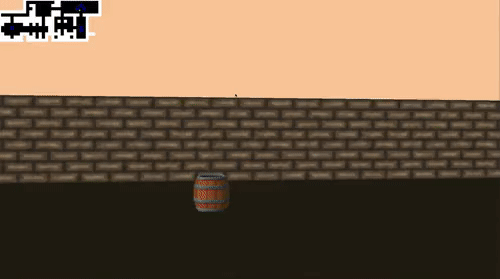

# Description
This is graphic game inspired by the Wolfenstein 3D (first FPS game).  
Here I used ray casting to draw realistic images. [Here you can read about ray casting](https://en.wikipedia.org/wiki/Ray_casting) 
([rus version](https://ru.wikipedia.org/wiki/Ray_casting))  
Player wanders the maze. Maze generates according configuration in map.cub  
:exclamation: Tested only on MacOS

###Player actions:  
* Move with 'W' and 'S' keys  
* Rotate point of view with 'A' and 'D'  
* Turn point of view 90 degrees with left/right arrows
* Look up/down with up/down arrows

# How to launch
1) Run "make" in root of repository
2) Run "./cub3D map.cub"

# Configuration
In file map.cub configuration of:
:exclamation: lines can be in different order, except map. Map must be the last.
* R - resolution of game window
* EA/NO/SO/WE - path for walls textures (characters means EAST/NORTH/SOUTH/WEST)  
* S - path for sprite texture
* map: 1 - wall, 0 - empty space, 2 - sprite
